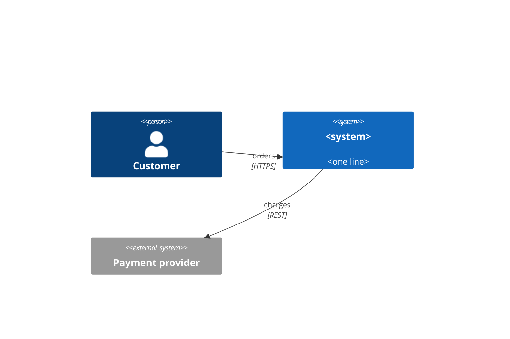
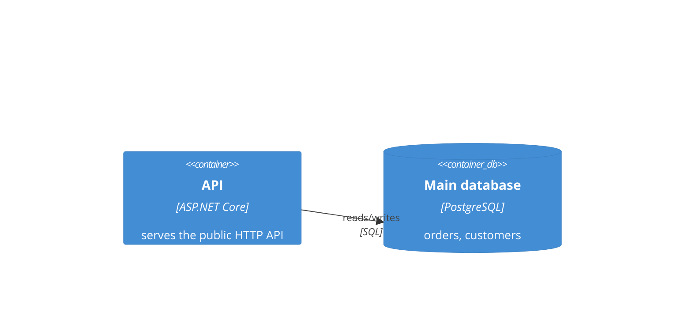
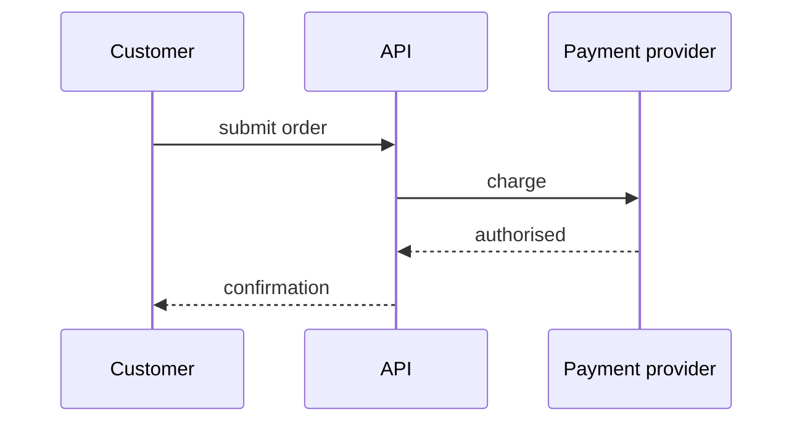

# Document templates

The single source of truth for what `architecture-docs` generates into a product repo: the file
set, the skeleton of every document, the content rules, and the `template_version` stamp.
Nothing else restates this structure — other files point here.

## File set

```
docs/
├── product/
│   ├── vision.md
│   ├── requirements.md
│   └── stories/
│       ├── README.md
│       └── <epic-slug>.md
├── architecture/
│   ├── README.md
│   ├── 01-context.md
│   ├── 02-constraints.md
│   ├── 03-containers.md
│   ├── 04-quality-scenarios.md
│   ├── 05-runtime.md            conditional
│   ├── 06-deployment.md         optional
│   └── 07-risks.md
└── adr/                         existing convention, not generated from a template here
CONTEXT.md                       glossary, repo root
```

`06-deployment.md` is created only when there is content for it; an empty optional document is
worse than a missing one. `05-runtime.md` is conditional — the rule that decides it lives in
[its own section](#docsarchitecture05-runtimemd-conditional) and nowhere else. Every other file in
the list is always created, with TODO questions where the answers are missing. ADRs keep the repo's
existing ADR convention and are written unchanged by this skill.

## template_version

Current value: **`2`**.

Every generated document starts with frontmatter carrying exactly this one key:

```markdown
---
template_version: 2
---
```

`CONTEXT.md` carries it too. ADRs do not — they are not generated from a template here.

- Bump the value by one whenever a skeleton or a content rule in this file changes what a
  generated document should look like. Rewording this file without changing the output is not
  a bump.
- `bootstrap` stamps the current value into every document it writes.
- `audit` reads the stamp before judging anything else:

| Stamp in the document | What a divergence from the solution means |
|---|---|
| equals the current value | the document was written to the current template — a divergence is real drift, in the solution or in the document's content |
| lower than the current value | the document predates the template — first offer to re-shape it to the current skeleton, keeping its content, then judge drift |
| absent | hand-written or pre-template; treat as lower, and re-shape only with the human's agreement |

- The stamp says nothing about content freshness. Never report "template_version is current" as
  evidence that a document matches the code.

## Rules for every document

- Frontmatter first, then a single `#` heading equal to the document's title, then the sections
  of its skeleton in the given order. Sections with no content are dropped, not left empty —
  except where the skeleton marks a section as always present.
- Every statement is confirmed by the human before it is written. An unconfirmed or open point is
  written as a TODO question on its own line, never as a guess:

  ```markdown
  > TODO(question): Which team owns the billing integration?
  ```

  One question per line, greppable as `TODO(question)`. It is the only TODO form used here.
- Anything that can be pointed at is pointed at: a repo path (`src/api/Program.cs:42`), an ADR id,
  a document id (`QS-03`, `FR-07`). A claim about the code with no path behind it is a TODO
  question instead.
- Ids are stable once published. New items take the next free number; a dropped item keeps its id
  with the state changed. Never renumber.
- Diagrams are mermaid fences in the markdown itself — no images, no external tools. Where the repo
  carries a `docs/architecture/*.c4` model, the C4 fences are generated from it with
  `likec4 gen mermaid`, not written by hand.
- Links between documents are relative paths (`../architecture/04-quality-scenarios.md#qs-03`).
- Terms used in the documents are defined once in `CONTEXT.md`, not re-explained per document.
- Plain English, no marketing tone, no restating the heading in the first sentence.

## docs/product/vision.md

Why the product exists. Comes from the interview only — never inferred from code.

```markdown
---
template_version: 2
---

# Vision

## Problem
What is broken or missing today, and for whom. Two to five sentences.

## Audience
| Group | What they need | How they reach the product |
|---|---|---|

## Goals
- <goal>: the change in the world, not the feature that delivers it

## Success metrics
| Metric | Today | Target | How it is measured |
|---|---|---|---|

## Out of scope
- <what this product deliberately does not do, and why>
```

**Done when** every goal has at least one metric with a stated measurement source, and
`Out of scope` names at least the nearest thing a reader would assume is included.

## docs/product/requirements.md

PRD-lite: what the product does, at the level above stories.

```markdown
---
template_version: 2
---

# Requirements

## Functional requirements
| id | Requirement | Stories | Quality scenarios |
|---|---|---|---|
| FR-01 | <capability, one sentence, testable> | [checkout](stories/checkout.md#s1) | QS-02 |

## Assumptions
| id | Assumption | Consequence if false |
|---|---|---|
| A-01 | | |

## Non-functional requirements
The measurable form lives in [04-quality-scenarios.md](../architecture/04-quality-scenarios.md);
list the ids that apply here and nothing more.
```

**Done when** every `FR` is phrased so that its truth can be decided by an observation, every
`FR` links to a story or carries a TODO question saying the story is missing, and every
assumption states what breaks if it turns out false.

## docs/product/stories/README.md

The epic index.

```markdown
---
template_version: 2
---

# Stories

| Epic | File | State | Requirements |
|---|---|---|---|
| Checkout | [checkout.md](checkout.md) | in progress | FR-01, FR-04 |
```

States: `planned` · `in progress` · `shipped` · `dropped`. Epic slug is lowercase kebab-case and
equals the file name without the extension.

**Done when** the table lists every `<epic-slug>.md` in the folder and every epic has a state.

## docs/product/stories/&lt;epic-slug&gt;.md

One file per epic. Stories are numbered `S1`, `S2`, … within the epic and referenced from
elsewhere as `<epic-slug>#S1`.

```markdown
---
template_version: 2
---

# Epic: Checkout

State: in progress · Requirements: FR-01, FR-04

## S1: Pay by card
As a <role> I want <capability> so that <outcome>.

**Acceptance criteria**
- Given <state>, when <action>, then <observable result>.
```

The link between stories and tasks points one way: a task names the story it implements in its own
`## Context`, and the story never lists tasks.

**Done when** every story has at least one Given/When/Then whose result is observable from
outside the system, every story names the requirement it serves, and no story carries task ids.

## docs/architecture/README.md

Index and maintenance rules — the entry point for anyone, human or agent, opening the folder.

```markdown
---
template_version: 2
---

# Architecture

<One paragraph: what the system is, in the words a newcomer would use.>

| Document | Contains | Update when |
|---|---|---|
| [01-context.md](01-context.md) | system boundary, external systems, stakeholders | an integration or channel is added or removed |
| [02-constraints.md](02-constraints.md) | non-negotiable constraints | a constraint is imposed or lifted |
| [03-containers.md](03-containers.md) | deployable units and their responsibilities | a deployable unit, store or interface between them changes |
| [04-quality-scenarios.md](04-quality-scenarios.md) | measurable quality scenarios | a measurable requirement changes |
| [07-risks.md](07-risks.md) | risks and technical debt | a risk appears, is mitigated or materialises |

Decisions live in [../adr/](../adr/); this folder describes the result, the ADRs say why.

## Maintenance
- A change that alters anything described here updates the document in the same branch.
- These documents describe the state as merged, not a plan; planned changes are risks or ADRs.
```

List `05-runtime.md` and `06-deployment.md` in the table only when they exist.

**Done when** the table lists exactly the documents present in the folder, each with a concrete
trigger for updating it.

## docs/architecture/01-context.md

The system as one box and everything outside it.

````markdown
---
template_version: 2
---

# Context



## External systems
| System | Direction | Channel | Data exchanged | Owner |
|---|---|---|---|---|
| Payment provider | outbound | REST over HTTPS | card charges, refunds | Payments team |

## Stakeholders
| Role | Interest in the system |
|---|---|
````

Direction is `inbound`, `outbound` or `both`. Channel is the concrete protocol and transport, not
"API".

**Done when** every external system in the table appears in the diagram and vice versa, and every
one has a channel a reader could find in the code.

## docs/architecture/02-constraints.md

What the architecture is not free to change.

```markdown
---
template_version: 2
---

# Constraints

| id | Constraint | Kind | Source | Consequence |
|---|---|---|---|---|
| C-01 | Runs on the customer's Windows hosts | technical | contract §4 | no Linux-only dependencies |
```

Kind is `technical`, `organisational` or `legal`. Source is who imposed it — a contract, a
regulation, a platform, a team decision recorded in an ADR.

**Done when** every row names a source, and nothing is listed that the team could decide to change
on its own (that is a decision, so it belongs in an ADR).

## docs/architecture/03-containers.md

The deployable units inside the system boundary.

````markdown
---
template_version: 2
---

# Containers



| Container | Responsibility | Technology | Where in the repo | Talks to |
|---|---|---|---|---|
| API | public HTTP surface, request validation | ASP.NET Core | `src/Api/` | Main database, Payment provider |

## Interfaces
| Contract | Published by | Consumers | Versioning |
|---|---|---|---|
| `src/Api/openapi.yaml` | API | Web, Partner integration | additive only |
| `contracts/order-placed.v1.json` | API | Fulfilment | new version per breaking change |

## Structure inside
The internal style and its enforcement, one short paragraph per container that has one, with the
ADR that decided it.
````

One `Interfaces` row per published contract, keyed by the contract artifact's path in the repo — an
OpenAPI document, a `.proto` file, an event schema. The row points at the artifact and never
restates what is in it: the artifact is generated from the truth, this table only makes it findable.
Versioning is a word or two — what a consumer can rely on.

**Done when** every container in the table has a matching deployable unit in the repo with a path,
or a TODO question saying why not; every container in the table appears in the diagram; every
`Talks to` entry is either another container or an external system from `01-context.md`; and every
`Talks to` edge that crosses a container boundary either maps to an `Interfaces` row or says on the
spot why it has none — in-process, ad-hoc, or a TODO question.

## docs/architecture/04-quality-scenarios.md

Measurable quality requirements. The reviewer's primary input, so every row must decide
pass/fail on its own.

```markdown
---
template_version: 2
---

# Quality scenarios

| id | Attribute | Source and stimulus | Environment | Response | Measure |
|---|---|---|---|---|---|
| QS-01 | performance | a customer submits an order | peak hour, 200 concurrent users | the order is confirmed | p95 under 500 ms |
| QS-02 | availability | the payment provider stops responding | normal operation | checkout degrades to "pay later" | no failed orders, alert within 1 min |
```

Attributes to cover, each present or explicitly recorded as not applicable: performance,
availability, security, data protection, observability, maintainability, portability.

**Done when** every row's `Measure` contains a number and a unit, `Response` names an observable
system behaviour rather than an intention, and no attribute from the list is silently missing.

## docs/architecture/05-runtime.md (conditional)

Required as soon as `03-containers.md` lists more than one container — this is where that rule
lives. For a single-container system it stays optional and is normally absent. Covers only the two
or three flows that matter: those that cross at least two containers and are not obvious from
`03-containers.md`.

````markdown
---
template_version: 2
---

# Runtime scenarios

## <Scenario name>
When it runs, and what it is for.



**Failure paths**: what happens when each remote step fails.
````

**Done when** every scenario names its failure paths, and every participant is a container from
`03-containers.md` or an external system from `01-context.md`.

## docs/architecture/06-deployment.md (optional)

Create only when there is more than one environment or the mapping to infrastructure is not
evident from the repo.

```markdown
---
template_version: 2
---

# Deployment

| Environment | Purpose | Where it runs | How it is deployed |
|---|---|---|---|
| production | live traffic | Azure Container Apps | GitHub Actions on a tag |

## Mapping
| Container | Artifact | Runtime unit | Scaling |
|---|---|---|---|
| API | `ghcr.io/org/api` image | container app, 2-10 replicas | CPU > 70% |

## Configuration and secrets
Where configuration comes from and where secrets are kept: names and locations, never values.
```

**Done when** every container from `03-containers.md` appears in the mapping, and the deployment
pipeline is named with the file that defines it.

## docs/architecture/07-risks.md

Risks and technical debt, each owned and each with a next step.

```markdown
---
template_version: 2
---

# Risks and technical debt

| id | Risk or debt | Impact | Likelihood | Owner | Mitigation | State |
|---|---|---|---|---|---|---|
| R-01 | single database is a single point of failure | QS-02 breached, checkout down | medium | Platform team | add a read replica and failover drill | open |
```

Impact, where possible, is stated as the quality scenario it breaks. Likelihood and impact are
`low` / `medium` / `high`. State is `open`, `mitigated` or `accepted`; an accepted risk names who
accepted it.

**Done when** every row has a named owner and a mitigation that is an action, not a wish.

## CONTEXT.md (repo root)

The glossary — the ubiquitous language of the repo. For repos generated by this skill this file
supersedes the glossary-in-state placement of ADR-0040.

```markdown
---
template_version: 2
---

# CONTEXT: glossary

<One line: whose language this is.> Terms and meanings only, no implementation.

| Term | Meaning |
|---|---|
| **Order** | A customer's confirmed intent to buy; the unit everything downstream is keyed by. |
```

One entry per domain term that appears in the generated documents or in the code's type names.
No technology names unless the team uses them as domain terms.

**Done when** every term used without explanation in `docs/product/` and `docs/architecture/` has
an entry, and no entry describes how something is implemented.
