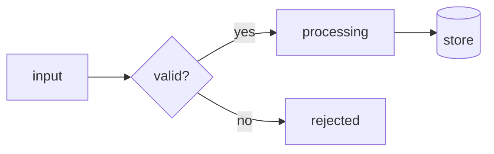
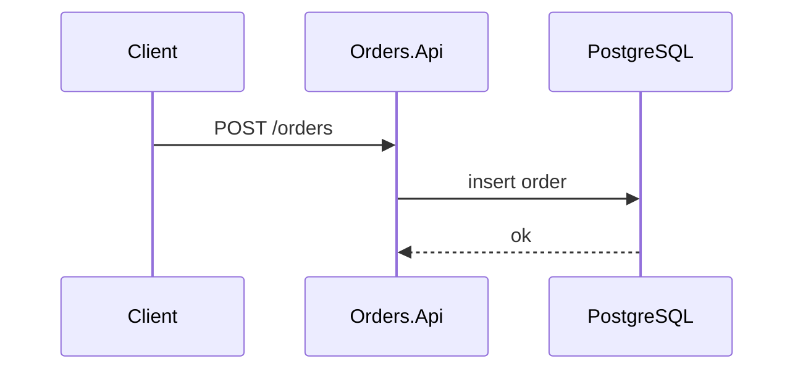
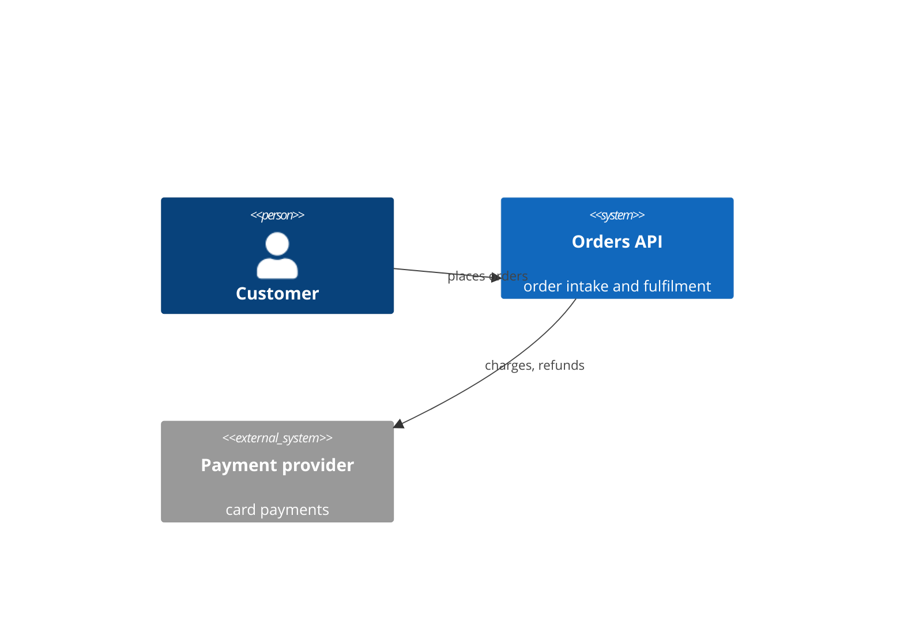
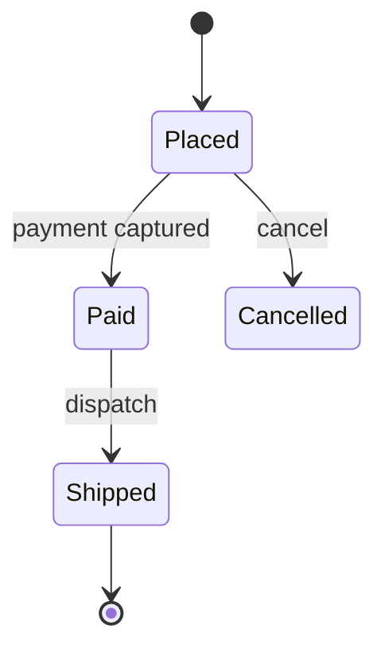
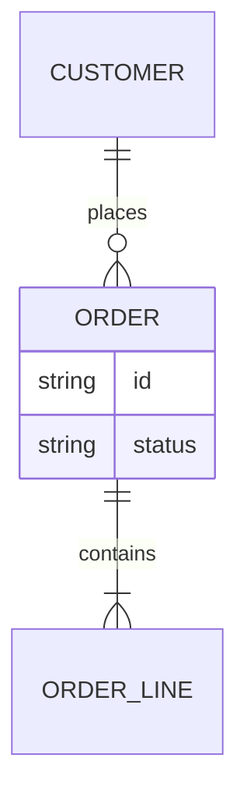
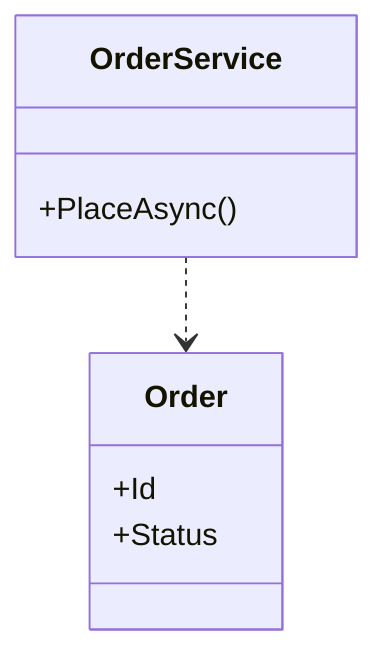
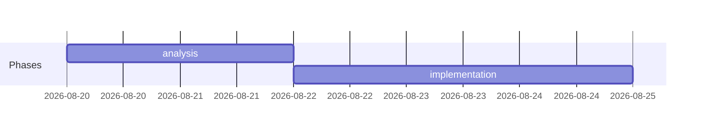
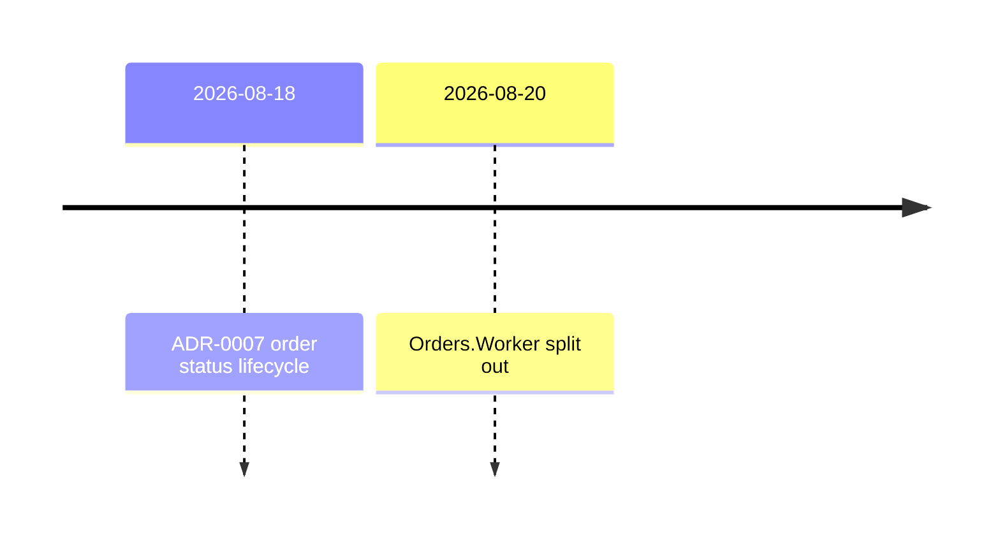
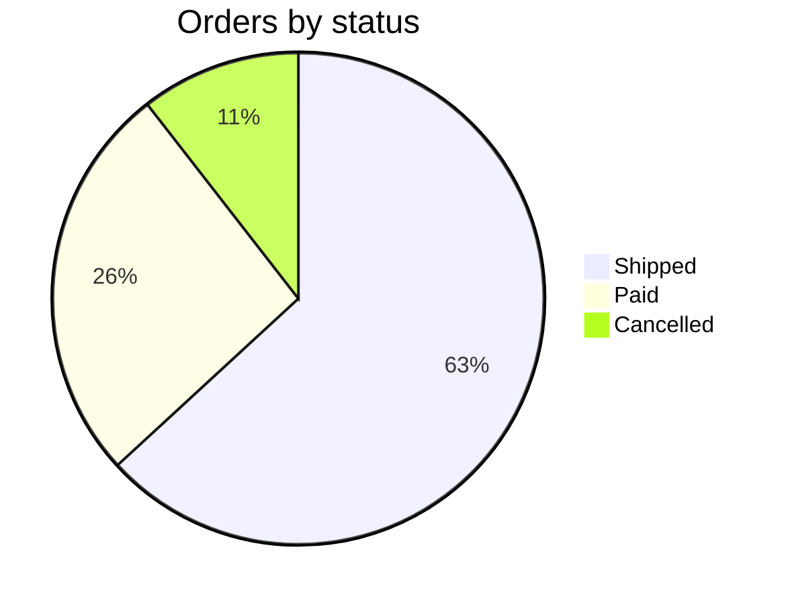
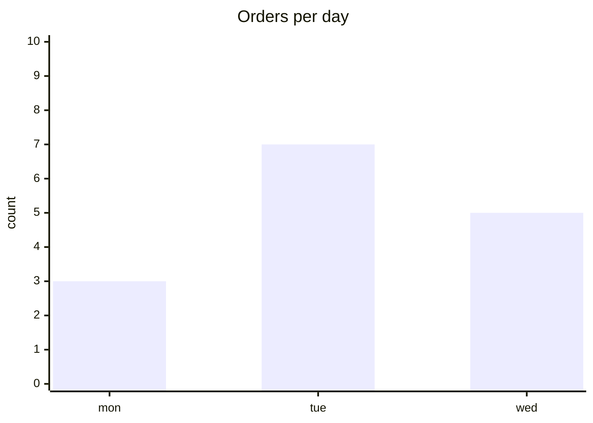

# Diagram catalogue (mermaid)

A diagram belongs inline in `## Findings`, right next to the passage it illustrates, not in a separate section
at the end. Pick by the question the diagram answers; when in doubt, take a flowchart.
Write a mermaid fence (```mermaid) directly in the markdown, no images, no external tools.

## Flowchart / data flow, `flowchart`

When: data flow, decision logic, a pipeline; "what flows where and what is decided at which point".



## Sequence, `sequenceDiagram`

When: component interaction over time, protocols, API calls; "who sends what to whom and in what order".



## C4 context, `C4Context`

When: architecture, system boundaries, external dependencies; "what the system is made of and what it talks to".



## State machine, `stateDiagram-v2`

When: a lifecycle and its transitions (e.g. order statuses); "which states a thing lives in and what flips it".



## ER, `erDiagram`

When: a data model, relationships between entities; "what is an entity, what is an attribute and what the cardinality is".



## Class, `classDiagram`

When: the structure of types and dependencies; "who depends on whom and what they carry".



## Gantt and timeline, `gantt`, `timeline`

When: phases, a plan, history over time; gantt for durations and overlaps, timeline for a sequence of events.





## Quantitative, `pie`, `xychart-beta`

When: ratios and simple metrics; anything beyond a few numbers belongs in a table, not a chart.




