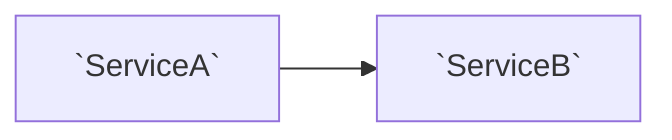

# Section skeleton

## The leading words

A **component** is a top-level namespace under a project's root. A **service** is a type other components
reach: a registration, a hosted service, an endpoint group, an interface with several implementations. The
**surface** of a service is the methods that have a caller outside its component, and the **neighbourhood**
of a node is its one-hop graph. The README's glossary defines the ones its sections use, in these terms.

## The shape

One `##` per project, one `###` per component, in this shape and nothing outside it. Every type name in
backticks must exist in the JSON slice; a type the slice does not carry is never named.

```markdown
## <Project>

<One sentence: what this project is for and which project it depends on.>

### <Component>

<One sentence: what this component is responsible for.>

**Flows.** <Two or three sentences: the main paths through it, entry first, which service calls which.>



**Services.**

| service | lifetime | surface (called from) |
|---|---|---|
| `ServiceA` | Singleton | `Do(x)` ← `ServiceB` (other component); `Run()` ← `Host` |

<Optional, one line: "n DTOs and m UI components not listed.">
```

Rules:

- The mermaid block holds the component's neighbourhood: its services and the types in other components that
  call them, at most 12 nodes. Bigger neighbourhoods keep the services and the three heaviest callers.
- The surface column lists only methods that have a caller in the slice; a service with an empty surface is
  listed with "no external caller".
- No method bodies, no properties, no private members, no test projects.
- A component with no service gets the responsibility sentence and the optional count line only.
